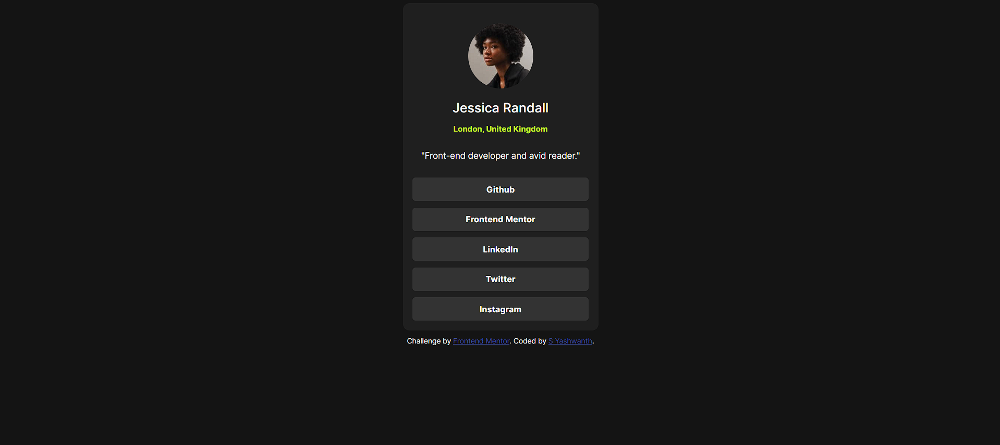
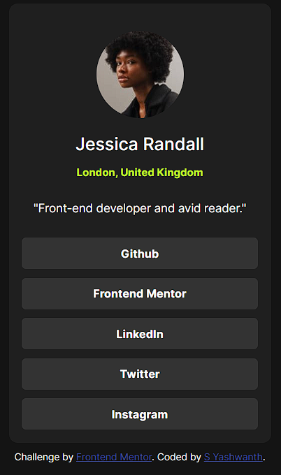

# Frontend Mentor - Social links profile solution

This is a solution to the [Social links profile challenge on Frontend Mentor](https://www.frontendmentor.io/challenges/social-links-profile-UG32l9m6dQ). Frontend Mentor challenges help you improve your coding skills by building realistic projects.

## Table of contents

- [Overview](#overview)
  - [The challenge](#the-challenge)
  - [Screenshot](#screenshot)
  - [Links](#links)
- [My process](#my-process)
  - [Built with](#built-with)
  - [What I learned](#what-i-learned)
  - [Continued development](#continued-development)
  - [Useful resources](#useful-resources)
- [Author](#author)
- [Acknowledgments](#acknowledgments)

## Overview

### The challenge

Users should be able to:

- See hover and focus states for all interactive elements on the page.

### Screenshot





### Links

- Solution URL: https://github.com/yashwanth-srinivasa/Frontend-mentor-social-media-links/
- Live Site URL: https://fem-social-media-links.netlify.app/

## My process

### Built with

- Semantic HTML5 markup
- CSS custom properties
- CSS Grid

### What I learned

There are a few things that I learnt:

1. Using CSS grid instead of flexbox.

```css
body    {
    display: grid;
    justify-content: center;
    align-items: center;
}
```

2. Creating hover animations for the buttons.

```css
.button:hover       {
    background-color: var(--green);
    transition: 0.25s;
    color: black;
}
```

3. Using the "width" CSS variable to "fit-content" to the main card.

```css
.link_card      {
    font-size: medium;
    background-color: var(--dark-grey);
    display: grid;
    align-items: center;
    justify-content: center;
    gap: 10px;
    text-align: center;
    border-radius: 10px;
    width: fit-content;
    padding: 15px;
}
```

### Continued development

I might actually use this with the previously completed QR code challenge to create a sort of landing page for myself.

### Useful resources

- [Coder Coder Light/Dark Social Media Dashboard Playlist on YouTube](https://www.youtube.com/watch?v=iL4irerdGdU&list=PLUWqFDiirlsu5az5EIyxe8ZddyNO_kDuP) - The first video in the playlist helped me to take a look at how someone might go about building a webpage in a professional environment, and it helped me understand what I need to do in the given challenge, try to look online for specific resources, and making functional notes allowing me to complete this project earlier than I anticipated by sort of consolidating said resources to which I turned whenever I had doubts on how to proceed.

## Author

- Frontend Mentor - [@yashwanth-srinivasa](https://www.frontendmentor.io/profile/yashwanth-srinivasa)
- Twitter - [@livingonGH320](https://www.twitter.com/livingonGH320)


## Acknowledgments

I would like to thank Jess Chan from Coder Coder for her Social Media Dashboard Page Playlist in YouTube.
